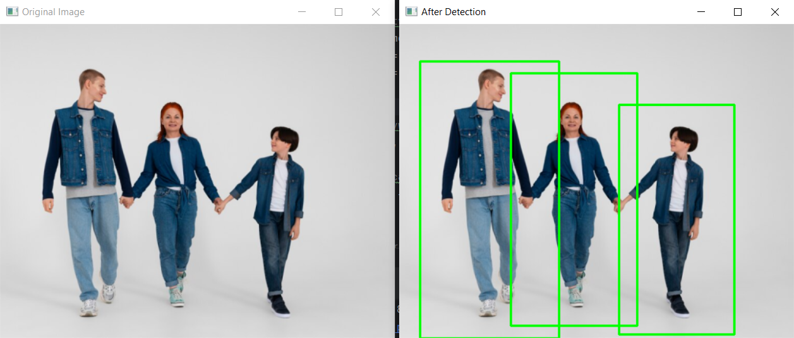

# UEKAT_MLDS - People Counter
Projekt został opracowany w ramach modułu "Technologie chmurowe" na studiach podyplomowych "Uczenie Maszynowe i Data Science".
### autor:Joanna Maszybrocka 

## Opis
People Counter to aplikacja napisana w języku Python, która wykorzystuje bibliotekę OpenCV oraz algorytm HOG (Histogram of Oriented Gradients) do detekcji ludzi na obrazach. Aplikacja oferuje elastyczne API z różnymi endpointami, umożliwiającymi zliczanie osób na obrazach, które użytkownik przesyła do analizy lub wskazuje adresem URL.

## Instalacja
Aby zainstalować projekt, wykonaj następujące kroki:

- Sklonuj repozytorium na swój lokalny komputer:
git clone https://github.com/jmaszybr/UEKAT_MLDS.git
- Przejdź do katalogu projektu:
cd UEKAT_MLDS-People-Counter
- Zainstaluj wymagane zależności:
pip install -r requirements.txt
- Uruchom aplikację:
python main.py

## Endpointy API

### 1. Zliczanie osób na obrazie przykładowym
- **Endpoint**: `GET /`
- **Parametry**: Brak. Używa wcześniej zdefiniowanego obrazu (`test06.png`).
- **Opis**: Endpoint przetwarza wcześniej zdefiniowany statyczny obraz i zwraca liczbę wykrytych osób.
- **Przykład użycia**:
http://localhost:5000/

### 2. Zliczanie osób na obrazu, który został wskazany przez URL
- **Endpoint**: `GET /dynamic`
- **Parametry**: `url` - adres URL obrazu do analizy.
- **Opis**: Pobiera obraz z podanego URL, przetwarza go za pomocą HOG i zwraca liczbę wykrytych osób.
- **Przykład użycia**:
http://127.0.0.1:5000/dynamic?url=https://www.fit.pl/img/WELLNESS/_max/nordic_walking.jpg

### 3. Zliczanie osób na obrazie, który został przesłany za pomocą formularza
- **Endpoint**: `GET /upload` i `POST /upload`
- **Opis**: `GET /upload` zwraca formularz HTML do przesyłania obrazów. `POST /upload` przyjmuje przesłany obraz, przetwarza go za pomocą HOG i zwraca liczbę wykrytych osób.
- **Parametry (POST)**: `file` - przesłany obraz.
- **Przykład użycia**:
Otwórz `http://localhost:5000/upload` w przeglądarce, aby użyć formularza do przesyłania.

## Detekcja za pomocą Histogram of Oriented Gradients (HOG)
- **Deskryptor HOG**: Używany do ekstrakcji cech z obrazów, które są następnie wykorzystywane do detekcji ludzi.
- **Detektor ludzi**: W kontekście detekcji osób, HOG jest często używany razem z maszyną wektorów nośnych (SVM - Support Vector Machine). W bibliotece OpenCV, obiekt HOGDescriptor jest konfigurowany z detektorem SVM, który jest specjalnie przeszkolony do detekcji osób. Jest to domyślny detektor osób dostarczany w tej bibliotece.
- **Parametry**: 
- `winStride`: Krok okna przesuwnego, przyjęto (4, 4).
- `padding`: Padding dla każdego okna, przyjęto (8, 8).
- `scale`: Skala obrazu, przyjęto 1.05.
 
## Format odpowiedzi
Wszystkie endpointy zwracają odpowiedzi w formacie:
- Sukces: `{ "filename": nazwa_pliku, "peopleCount": liczba }`
- Błąd: `{ "error": "opis błędu" }`

## Informacje dodatkowe

W Folderze Examples, znajduje się skrypt `detect_people_and_display.py`, który wykorzystuje bibliotekę OpenCV do detekcji osób na obrazach. Skrypt wczytuje obraz, przetwarza go za pomocą deskryptora HOG, a następnie wyświetla oryginalny obraz i obraz z zaznaczonymi wykrytymi osobami, informując o ich liczbie. Jest to narzędzie gotowe do użycia i dostosowania do własnych potrzeb w projektach związanych z przetwarzaniem obrazów i rozpoznawaniem obiektów. W katalogu znajdują się również przykładowe obrazy do analizy.

Przykład analizy

obrazy testowe pochodzą z serwisu: https://www.freepik.com/

aktualizacja 30.01.2024

## Dalsze prace
Użytkownik może posiadać swój własny formularz na stronie internetowej, który jest skonfigurowany do komunikacji z zewnętrznym API. Taki formularz pozwala użytkownikowi na wybór i przesyłanie danych do analizy. 
Przykład jest realizowany w repozytorium: https://github.com/jmaszybr/PhotoPeopleCounter_API.git
